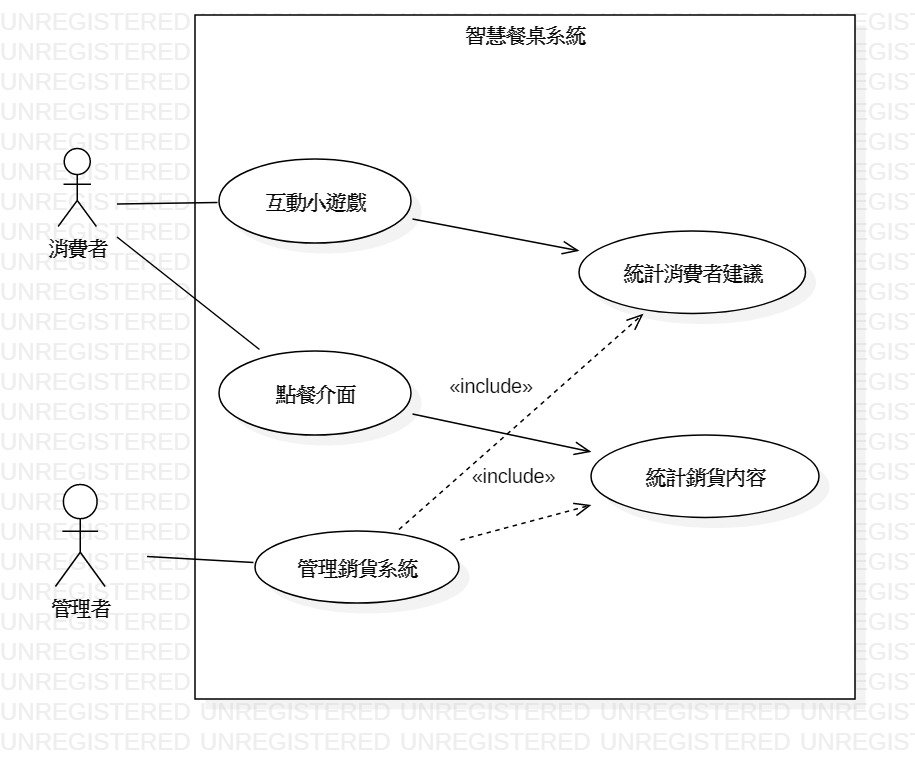
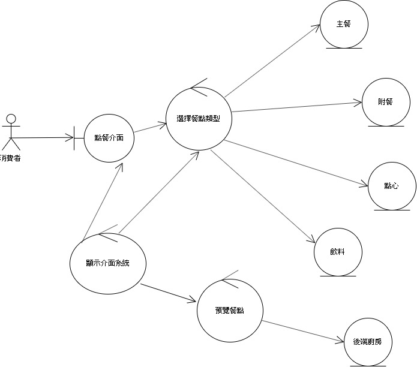

### 姓名：薛日仁
***
### 學號：0624017
***
### 資管系三甲
***
### 專題名稱：
***
### 小組成員:

> * **0624017 薛日仁**
> * 0624061 邱美萱
> * 0624027 陳水墻
> * ~~0624073 楊凱勛~~
***
HOMEWORK

<https://www.nkust.edu.tw/>

## 專題題目
智慧商業餐桌
## 文字敘述專題需求
提供消費者對於用餐的更多體驗，同時提供後端消費者資訊進而調整成本及營運重心
## 寫出專題之功能性需求與非功能性需求
### 功能性需求 
- 電子菜單提供點餐與介紹
- 提供消費者間互動小遊戲
- 提供依照消費者健康需求的推薦商品、消費紀錄
### 非功能性需求
- 操作_系統能夠彙整會員消費紀錄
- 效能_自動點餐降低人事成本
- 安全_操作過程無個資問題
- 文化_具有多國語言供使用者選擇
## 使用案例圖 (use case diagram)

## 由上而下 排出 使用案例的重要性
1. 電子點餐
2. 後端統計銷售資訊
3. 消費者互動小遊戲

## 寫出 三個使用案例
A.電子點餐
> A-1 啟動點餐系統  
> A-2 畫面出現  
>     主頁面：主餐、附餐、點心、飲料   
>     當日主廚推薦   
>     客製點餐  
> A-3 開始點餐 > 送廚  
   
B. 後端統計銷售資訊  
> B-1 整合來自點餐系統內容  
> B-2 將整合過的資料作成月報表和日報表，供業者使用  
> B-3 業者可從報表中判斷是否需要調整成本  

C. 消費者互動小遊戲
> C-1 用手機號碼登入會員 
> C-2 進入遊戲畫面 
> C-3 透過遊戲增進情感 
## 寫出 user story 
 * 案例一：身為一個客人點餐時，我希望除了傳統菜單內容還能依照自己想要的口味或健康調整，也能有查詢過往消費紀錄這樣才能，這樣才能有更多符合我的需求的點餐系統

 * 案例二：身為一個老闆，我希望系統能依照消費者於不同的季節所喜好的不同料理，以及消費者不同身分不同的消費時段，等等有效統計資訊加以整理，並以圖表顯示，這樣我才能幫助下一期的營運更有效率

 * 案例三：身為一個客人，我希望在用餐之餘能跟用餐對象能有互動的小遊戲也能進一步更了解對方，這樣才能讓我跟對方在用餐之餘也能增進情誼
 
 * 案例四：身為一個老闆，我希望能藉由互動小遊戲能了解消費者來用餐時的喜好程度還有建議，這樣我才能針對消費者給我的建議來改善營運方針來提高營收

##  初步類別圖

##  系統循序圖

##  強韌圖

